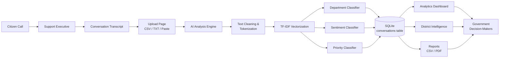
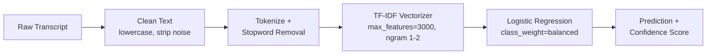

# CitizenVoice AI

**AI-Powered Public Complaint Intelligence and Analytics Platform**

CitizenVoice AI turns unstructured citizen-support conversations into structured,
actionable intelligence for government departments. It automatically classifies
each conversation by responsible department, scores sentiment, detects priority,
extracts keywords, and surfaces trends across districts and departments — all in
a local Streamlit dashboard backed by SQLite.

> Built as a one-week internship-scope MVP. Deliberately simple: no
> microservices, no Kubernetes, no cloud, no enterprise auth — just a clean,
> functional proof of concept with real trained ML models.

---

## 1. What it does

```
Citizen → Support Executive → Conversation Transcript
        → AI Analysis Engine (classification + sentiment + priority + keywords)
        → SQLite Analytics Store
        → Streamlit Dashboard → Government Insights
```

| Capability | Detail |
|---|---|
| **Complaint classification** | Transcript → responsible department (e.g. "No water supply for four days" → Water Authority) |
| **Sentiment analysis** | Positive / Neutral / Negative + confidence score |
| **Priority detection** | Low / Medium / High / Critical |
| **Keyword extraction** | Per-transcript issue keywords + district/location mentions |
| **Trend analysis** | Department/district volume, monthly trends, sentiment-by-district, priority heatmaps |
| **Reporting** | CSV export, branded PDF report, department summary table |

---

## 2. Tech stack

- **Frontend:** Streamlit (`st.navigation` / `st.Page` multipage app)
- **ML:** scikit-learn (TF-IDF + Logistic Regression pipelines), regex/rule-based NLP preprocessing
- **Data:** Pandas, synthetic dataset generator
- **Visualization:** Plotly
- **Storage:** SQLite (+ CSV seed file)
- **Reporting:** ReportLab (PDF generation)
- **Deployment:** Local only — `streamlit run app.py`

---

## 3. Architecture

### System flow



### ML pipeline (per model)



Three independent pipelines (department / sentiment / priority) are trained the
same way, each saved as its own `.pkl`, and all three run on every transcript
at inference time.

### App navigation architecture

`app.py` is the single entry point. It calls `st.set_page_config()` once,
defines every page as an explicit `st.Page(path, title=, icon=)`, and routes
through `st.navigation([...])`. Each file in `pages/` is a standalone script
(not a function module); they share state via `utils/state.py`, which wraps
the DB connection, loaded models, and cached dataframe in `st.cache_resource`
/ `st.cache_data` so every page reads from the same cache instead of
re-loading models or re-querying SQLite on every click.

---

## 4. Folder structure

```
citizenvoice-ai/
├── app.py                      # Entry point — st.navigation page registry
├── requirements.txt
├── README.md
├── pages/
│   ├── home.py                 # Landing page / KPIs / overview
│   ├── upload.py                # CSV / TXT / paste upload + Analyze + Clear
│   ├── analysis.py              # Single-transcript AI Analysis preview
│   ├── dashboard.py             # Analytics Dashboard (KPIs + 6 charts)
│   ├── district.py              # District Intelligence (filters + heatmaps)
│   ├── reports.py               # CSV / PDF / department summary reports
│   └── settings.py              # Model status, DB stats, reset-to-seed
├── models/
│   ├── classifier.pkl           # Department classifier (94.5% test accuracy)
│   ├── sentiment.pkl            # Sentiment classifier (100% test accuracy*)
│   └── priority.pkl             # Priority classifier (100% test accuracy*)
├── data/
│   └── conversations.csv        # 1000-row synthetic seed dataset
├── utils/
│   ├── preprocessing.py         # Text cleaning, tokenizing, keyword/location extraction
│   ├── inference.py             # load_models() + analyze_transcript()
│   ├── charts.py                # Plotly figure builders (brand-themed)
│   ├── report_generator.py      # CSV / PDF report generation (ReportLab)
│   ├── state.py                 # Shared cached DB connection / models / data
│   └── theme.py                 # Government Command Center CSS + badge helpers
├── database/
│   ├── db.py                    # Schema, init/seed/insert/fetch helpers
│   └── sqlite.db                # SQLite database (auto-created on first run)
└── notebooks/
    ├── generate_dataset.py      # Synthetic dataset generator
    └── train_models.py          # Trains and saves all three models
```

\* 100% accuracy on sentiment/priority reflects the synthetic dataset's
template-driven separability (see [Section 7](#7-design-decisions--known-limitations)) — expected for
demo data, not representative of noisy real-world transcripts.

---

## 5. Installation & setup

### Requirements
Python 3.9+

### Quick start (uses the pre-generated dataset and pre-trained models already in this folder)

```bash
cd citizenvoice-ai
pip install -r requirements.txt
streamlit run app.py
```

That's it. On first launch, `app.py` automatically creates and seeds
`database/sqlite.db` from `data/conversations.csv` (via `utils/state.py` →
`database/db.py`) — no manual DB setup step is required.

### Rebuilding from scratch (optional)

If you want to regenerate the dataset and retrain the models yourself:

```bash
pip install -r requirements.txt

# 1. Generate a fresh 1000-row synthetic dataset → data/conversations.csv
python notebooks/generate_dataset.py

# 2. Train all three models → models/*.pkl
python notebooks/train_models.py

# 3. (Optional) Re-initialize the DB from the new CSV — app.py would also
#    do this automatically the first time it runs against a missing DB.
python database/db.py

# 4. Launch
streamlit run app.py
```

The app opens at `http://localhost:8501`.

---

## 6. Using the app

1. **Home** — overview of total conversations, departments, districts, and system capabilities.
2. **Upload Data** — upload a CSV (`transcript` column required; `district`/`date` optional), a `.txt` file (use a line containing only `---` to separate multiple transcripts), or paste one transcript directly. Click **Analyze** to run all three models and save results to the database, or **Clear** to discard the pending batch.
3. **AI Analysis** — pick a sample transcript or paste your own to preview department / sentiment / priority predictions with confidence scores and extracted keywords. This page is preview-only (not saved) — use **Upload Data** to persist records.
4. **Dashboard** — KPIs and six charts: complaints by department, complaints by district, sentiment distribution, priority distribution, monthly trends, and top keywords.
5. **District Intelligence** — filter by district, date range, and department; view filtered KPIs, department/priority breakdowns, sentiment trends, and a district × department heatmap.
6. **Reports** — filter by scope, then download a CSV export or a branded PDF report (executive summary, department summary, priority breakdown, district summary).
7. **Settings** — model status, database record counts, and a guarded "Reset Database to Seed Data" action.

---

## 7. Design decisions & known limitations

- **No `nltk.download()` at runtime.** `nltk` is listed in `requirements.txt`
  per the original spec, but the actual text pipeline
  (`utils/preprocessing.py`) uses a small built-in stopword list and regex
  tokenization instead. This avoids a hard runtime dependency on internet
  access to fetch NLTK corpora the first time the app runs — important for
  a local/offline government deployment.
- **`st.navigation()` / `st.Page()` instead of Streamlit's automatic
  `pages/` folder detection.** The spec's literal folder structure
  (`pages/home.py`, `upload.py`, etc.) is used, but routed explicitly from
  `app.py` rather than relying on Streamlit's filename-based auto-sidebar.
  This gives full control over page titles, icons, and order (matching the
  spec's exact sidebar: 🏠 Home, 📤 Upload Data, 🤖 AI Analysis, 📊
  Dashboard, 🗺 District Intelligence, 📥 Reports, ⚙ Settings) and avoids
  duplicate/conflicting navigation UI. Requires Streamlit ≥ 1.36.
- **Synthetic data, not real complaints.** The dataset is template-generated
  (see `notebooks/generate_dataset.py`) with realistic Kerala-context
  phrasing per category and severity tier. Because templates are fairly
  separable by design, sentiment and priority models score 100% on the held-out
  test split — this demonstrates the pipeline works end-to-end, but a
  production deployment on real, messier transcripts should expect lower
  (and more meaningful) accuracy and would benefit from a larger, human-labeled
  dataset.
- **Local-only by design.** Per the project constraints, there is no auth
  layer, no multi-user concurrency handling, and no cloud deployment
  config — this is intentionally a single-user local proof of concept.

---

## 8. Future scope

As outlined in the original project brief, natural extensions beyond this MVP:

- Malayalam NLP (native-language transcript support)
- Speech-to-text ingestion from recorded calls
- Real government data integration
- Predictive analytics (forecasting complaint volume/hotspots)
- Department recommendation engine for ambiguous complaints
- Complaint hotspot detection
- Geospatial visualization (map-based district views)
- Real-time monitoring / streaming ingestion

---

## 9. License & attribution

Built as an internship-scope MVP. Dataset is entirely synthetic — no real
citizen or department data is used or included.
